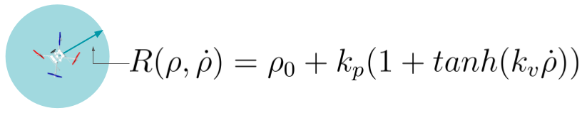
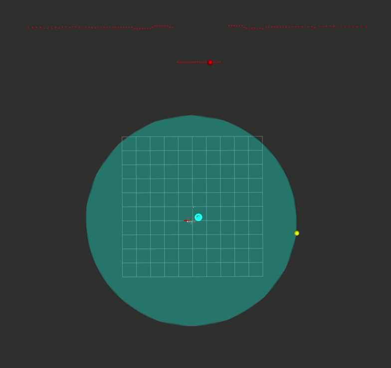

# UAV Collision Avoidance using 2D Lidar


### About this project

<b>Autors</b>:

Ivan, Changoluisa<br> 

This project implements a reactive collision avoidance for a UAV using a 2D Lidar and the concept of dynamic safety radius $R$ presented by [1]. The dynamic radius allows to trigger  lateral and vertical collision avoidance strategies by setting virtual scape points in the 3D space. The dynamic radius is a function of the velocity of the UAV towards the closest obstacle $\dot{\rho}$ defined as shown below.


 

The parameters $k_p$ and $k_v$ have to be calibrated according to the speed of the UAV. The collision avoidance strategy is activated as soon as the UAV detects that a collision point has entered the safety radius.  If the UAV is below the set maximum height, the UAV will perform a lateral and vertical scape at the same time. However, only lateral scapes are allowed once the maximum height has been exceeded. The escape point is orthogonal to the direction towards the closes obstacle and its sent as an input pose to the trajectory planner available in the simulator. After the surroundings of the UAV are clear of obstacles, the UAV will move to the initial goal. 

This project has been created as part of the Seminar 1 course of the IFROS Master in the University of Zagreb. 

---

## User's Guide 
---
This project was tested on the [UAV-ROS-Simulation](https://github.com/larics/uav_ros_simulation) developed by LARICS team. To test the system, clone the package inside the uav_ws and navigate to the startup folder by using:

```console
    cd uav_ws/src/collision_test/startup
```

Then run the startup script

```console
    /uav_ws/src/collision_test/startup/.start.sh
```
This script will open a Tmuxinator session in which the fifth pane will show the status of the collision avoidance system. This session will also open RVIZ with a configuration that allows visualizing the safety radius along with the goal, collision, and scape points in the 3D space. An example of this visualization is shown below.  
 
 
 


[1]: M. C. P. Santos, L. V. Santana, A. S. Brandão and M. Sarcinelli-Filho, "UAV obstacle avoidance using RGB-D system," 2015 International Conference on Unmanned Aircraft Systems (ICUAS), Denver, CO, USA, 2015.